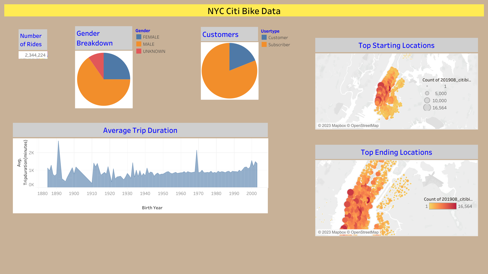
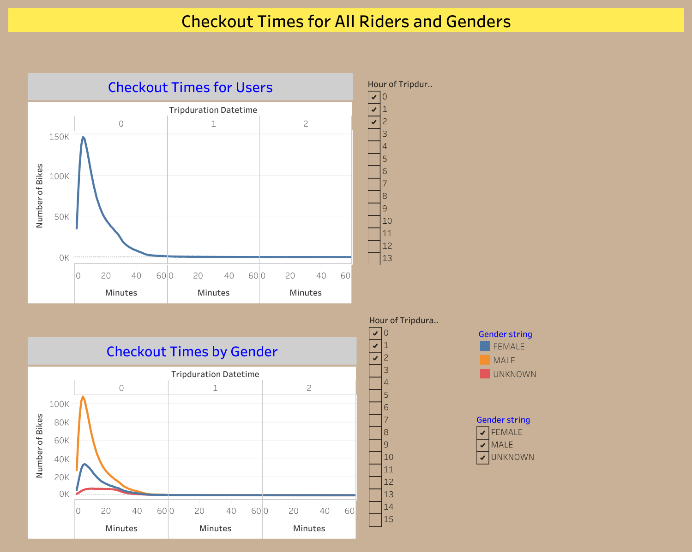
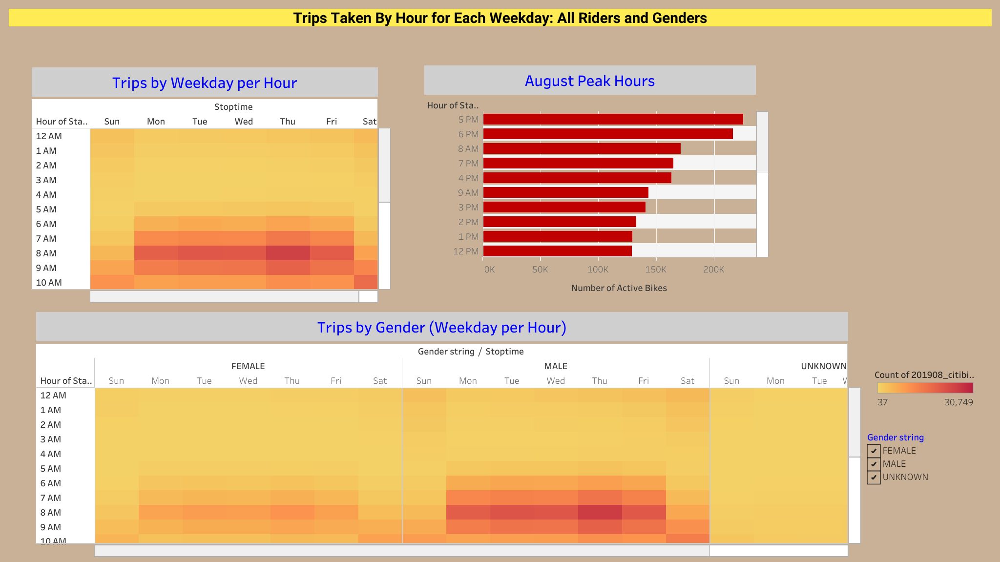
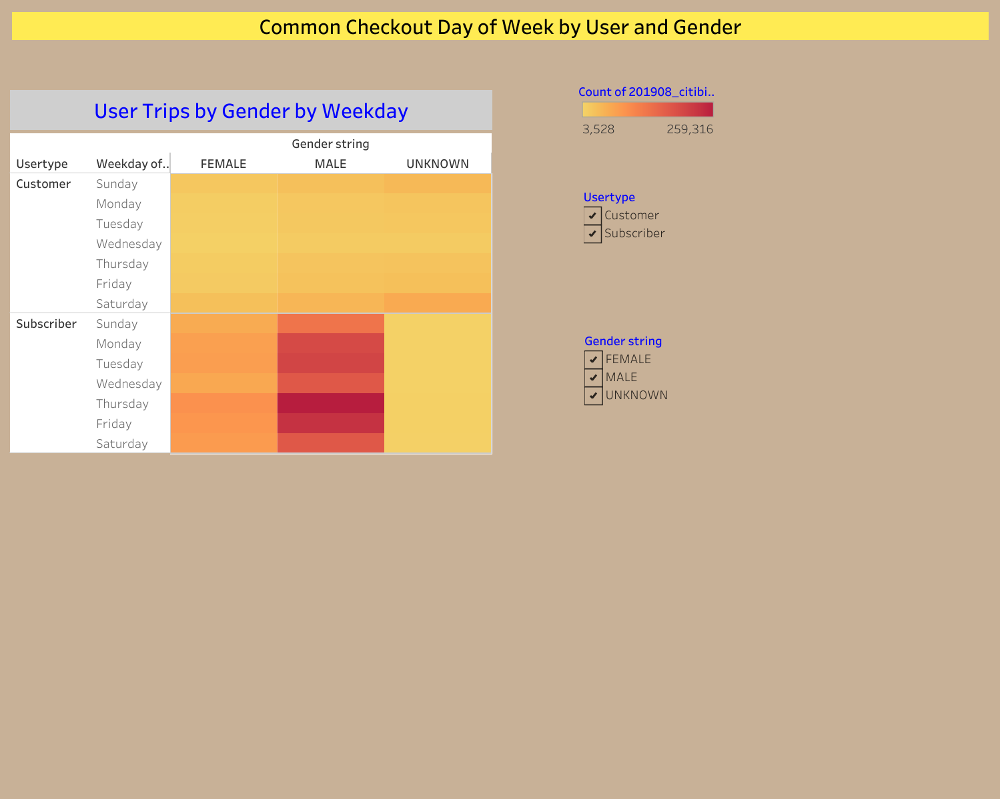
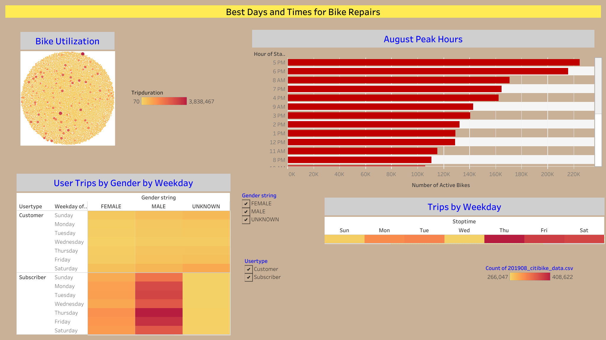

# bikesharing

## OVERVIEW OF ANALYSIS

For this project, we used Pandas and Tableau to analyze data from the Citi Bike program in New York City for the month of August (2019). 

### Purpose
The purpose of this analysis was to create visualizations from the Citi Bike data to help convince potential investors of the viability of exploring a similar bike-sharing business in Des Moines. 

## RESULTS
### Tableau Analysis
The full Tableau story can be viewed here: [NYC Citi Bike Analysis Dashboard](https://public.tableau.com/shared/KFYGZ36SG?:display_count=n&:origin=viz_share_link)

### 
**1. NYC Citi Bike Data**

Fig.1 - NYC Citi Bike General Dashboard

#### Description of Results
- Total number of trips recorded: 2,344,224 
- Type of Users: 81% of bikes were checked out by Subscribers (1,900,359 users), while 19% of bikes were checked out by Customers (443,865 users) 
- Gender of Users: 65% were Male (1,530,272 users), 25% were Female (588,431 users), 10% Unknown (225,521 users) . NOTE: The number of male users is almost 3 times that of female users!
- We can see that ride duration increases when age decreases, with the exception of some outliers in our data.
- The maps of starting locations and ending locations shows that bike trips are been taking in the whole city, with key locations being the ones with the most tourist/busy areas of Manhattan.

**2. Checkout Times for All Riders and Genders**

Fig.2 - Checkout Times Dashboard

#### Description of Results
- Checkout time for all users is mainly under 60 minutes, with a peak of 5 minutes use for 146,752 users. 
- As the time increase, the number of users decreases. 
- Male riders account for the majority of the bike rides. 
- The average checkout time is approximately the same for both male and female riders: Male riders have a peak at 5 minutes while female have a peak at 6 minutes

**3. Trips Taken by Weekday and Hour**

Fig.3 - Trips Take by Hour and Weekday: All Riders & Genders

#### Description of Results
- The highest number of bike trips is on Thursday.
- The highest number of trips is between 5pm and 7pm of each day of the week. This number decreases as we go after 7pm to reach the the lowest values between 12am and 4 am.
- Though the numbers are higher for male riders, the highest number of trips for each gender remains between 5pm and 7pm.

**4. Checkout Day by User and Gender**

Fig.4 - Most Common Checkout Day of Week by User and Gender

#### Description of Results
- In general, the probability of a male rider checking a bike is higher than that of a female or unknown gender for any given day of the week.
- For Subscribers riders, there's no exact trend of which days are busier than others, however we can notice that the biggest number of bike rentals is on Thursday for all the genders.
- For Customer riders, the number of rented bikes is larger from Friday to Saturday, for all gender types. Additionally, Saturday is the day with the largest number of customers' users. This may be because customer riders are likely to be visitors or tourists while subscribers are more like to be local.

**5. Best Days and Times for Bike Repairs**

Fig.5 - Best Days and Times for Bike Repairs

#### Description of Results
- Based on the Bike Utilization bubble created, one could check the bike ID with most utilization time, in order to check them for repairs.
- Using the horizontal bar chart, we can visualize the number of bike trips according to each hour of the day. The best times for bike repairs (least amount of riders) would be from from 9 pm to 4 am, with the timeframe from 12 am-4 am being ideal.
- The heat map confirms that the day with the lowest number of rides is Wednesday, which could be the best option for bike repairs. 

## SUMMARY
The data shows high activity of the bike sharing service in New York City during the month of August in 2019. The large majority of the rides were completed in Manhattan by male users, mostly during morning and evening rush hours. This may indicate that Citi Bike services are used as an alternative to public transportation by commuting workers during the weekday. Based on this analysis, investing in the bike-sharing program in Des-Moines is a solid business proposal. However, additional visualizations may necessary to increase the company's profits and to ensure successful implementation of the bike-sharing program in Des Moines. 
Some suggested visualizations for future analysis are:
- comparing data for different months to determine trends across the year,
- including weather data to find the correlation between the weather and the rides. 
